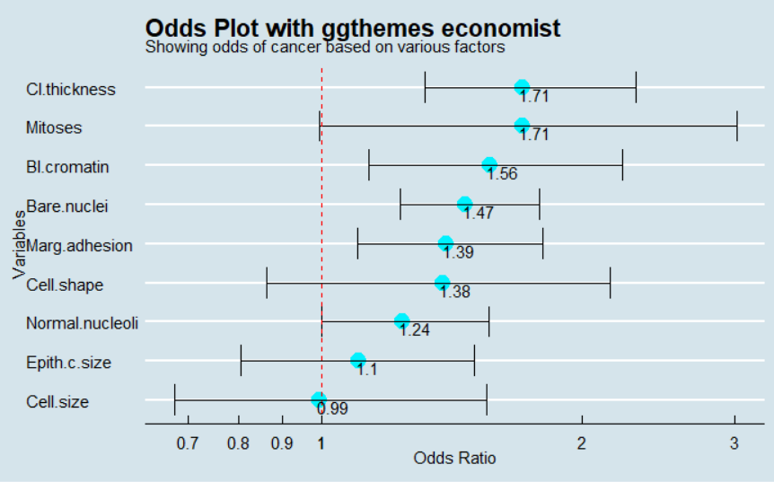

# OddsPlotty - the package for visualising odds ratios after conducting hard core statistics / ML

 <!-- badges: start -->
  [](https://github.com/StatsGary/OddsPlotty/actions)
  [](https://CRAN.R-project.org/package=OddsPlotty)
  [](https://mybinder.org/v2/gh/StatsGary/OddsPlotty/master)
  [](https://cran.r-project.org/package=OddsPlotty)
  [](https://cran.r-project.org/package=OddsPlotty)
  
  <!-- badges: end -->

A package to create odds plots after running a GLM


     
<h2>Package Installation </h2>
The package can be installed by using the following command : <strong>devtools::install_github("StatsGary/OddsPlotty", dependencies=TRUE)</strong> directly from GitHub. If Devtools is not loaded on to your machine - then this can be done by using install.packages("devtools") or using the package installation UI in R Studio. 

The main way to install is to get the package from CRAN, as follows:

``` r
install.packages("OddsPlotty") # if not already installed

```
## Loading Package into R Project

To load the package into the library you can achieve this as hereunder:

``` r
library(OddsPlotty)

```

<h2>What does this do?</h2>
<p>This package allows the user to generate multiple odds ratio plots. These are the outcome of fitting a logistic regression model and will show how the odds work. The vignette explains how to train a model and then use the odds plot package.</p>

## Using the package

The following shows how to take the results of a predictive model trained in CARET and produce the Odds Plots via OddsPlotty:

``` r
# Pass in the trained model from CARET and expose the finalModel list element from CARET
plotty <- OddsPlotty::odds_plot(glm_model$finalModel, 
                      title = "Odds Plot with ggthemes economist",
                      subtitle = "Showing odds of cancer based on various factors",
                      point_col = "#00f2ff",
                      error_bar_colour = "black",
                      point_size = .5,
                      error_bar_width = .8,
                      h_line_color = "red") 

plot <- plotty$odds_plot #Returns the plot element from the list
plot <- plot + ggthemes::theme_economist() + theme(legend.position = "NULL")

# Add odds ratios to labels by calling the data list element
# The round function is used to return 2 decimal place values
plot + geom_text(label=round(plotty$odds_plot$data$OR, digits=2), 
                             hjust=0.1, vjust=1)


```

This returns:



To get the tibble from the list, simply use the plotty variable, or whatever you call it, to return the odds ratios and the confidence intervals:

``` r
plotty$odds_data

```

## Find out more...

To find out more, please use the Vignette associated with this <a href="https://rpubs.com/StatsGary/783100">package</a> for the full and correct usage.


<h2>More packages</h2>
In the coming months I aim to produce all my packages I have been previously squirreling away on to Github, so please look out for those. 

<strong>Created and owned by Gary Hutson.</strong>
