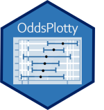

```{r, include = FALSE}
knitr::opts_chunk$set(
  collapse = TRUE,
  comment = "#>"
)
```



This package has been created to create odds plot for the results of a logistic regression. 

The package uses caret to train the model and the final model parameter is used to generate the application.


## Loading OddsPlotty

To use the odds_plot function you can invoke it by using:

```{r inv_odds_plot}
library(OddsPlotty)

```

## Training a GLM to use with odds plot

First we load the required packages. The example dataset we are going to use to work with OddsPlotty is the breast cancer data:

```{r load_pack}
library(mlbench)
library(caret)
library(tibble)
library(ggplot2)
library(OddsPlotty)
library(e1071)
library(ggthemes)

```
Then we are going to load the data we need for the breast cancer data:

```{r data}
data("BreastCancer", package = "mlbench")
#Use complete cases of breast cancer
breast <- BreastCancer[complete.cases(BreastCancer), ] #Create a copy
breast <- breast[, -1]
head(breast, 10)
#Convert the class to a factor - Beningn (0) and Malignant (1)
breast$Class <- factor(breast$Class)
str(breast)

```

This takes care of the class encoding but now we need to code the factors to numeric

```{r data_loop}
for(i in 1:9) {
  breast[, i] <- as.numeric(as.character(breast[, i]))
}
#Loops through the first columns - 1 to 9 and changes them from factors to a numerical representation
str(breast)

```

This has now changed the data into a numerical value and this can now be used in the GLM model. 

## Training the GLM using Caret

I will use Caret to train the Generalised Linear Model (GLM) aka Logistic Regression, as this is the package that best supports the odds plot statistics. Please note: I am training on the full dataset and not undertaking a data partitioning method, as perhaps seen in logistic regression.

```{r train_glm}
library(caret)
glm_model <- caret::train(Class ~ .,
                   data = breast,
                   method = "glm",
                   family = "binomial")

summary(glm_model)

```
Once the model is trained we can inspect the results with OddsPlotty:

## Visualise with OddsPlotty

The below shows how to visualise and expose the plot from the saved list in OddsPlotty. 

```{r odds_plot, echo = FALSE}
plotty <- OddsPlotty::odds_plot(glm_model$finalModel,
                      title = "Odds Plot",
                      subtitle = "Showing odds of cancer based on various factors")


plotty$odds_plot
```


## Exposing the data frame

Each odds plot has an associated tibble under the hood for querying. To access the tibble use:

```{r oddstibble, echo = FALSE}
plotty$odds_data
```

## Using different themes with additional parameters

Additional parameters for the plot can be fed in:

```{r odds_plot_two, echo = FALSE}
library(OddsPlotty)
library(ggthemes)
plotty <- OddsPlotty::odds_plot(glm_model$finalModel, 
                      title = "Odds Plot with ggthemes economist",
                      subtitle = "Showing odds of cancer based on various factors",
                      point_col = "#00f2ff",
                      error_bar_colour = "black",
                      point_size = .5,
                      error_bar_width = .8,
                      h_line_color = "red") 

plot <- plotty$odds_plot 
plot <- plot + ggthemes::theme_economist() + theme(legend.position = "NULL")

# Add odds ratios to labels by calling the data list element
# The round function is used to return 2 decimal place values
plot + geom_text(label=round(plotty$odds_plot$data$OR, digits=2), 
                             hjust=0.1, vjust=1, color="navy")

```

Another example of how to use a different theme:

```{r themes}
library(OddsPlotty)
library(ggthemes)
plotty <- OddsPlotty::odds_plot(glm_model$finalModel, 
                      title = "Odds Plot with ggthemes Tufte Theme",
                      subtitle = "Showing odds of cancer based on various factors",
                      point_col = "#00f2ff",
                      error_bar_colour = "black",
                      point_size = .5,
                      error_bar_width = .8,
                      h_line_color = "red")

plotty$odds_plot + ggthemes::theme_tufte()

```


## Training the Model with logistic_reg() TidyModels object

As TidyModels utilises the underlying lm and glm packages, which CARET also uses, then the way to train with a TidyModels wrapper would be as follows. I will use the cancer data we have been working with for consistency.

The model requires the raw odds, not the Log Odds, as these get converted in the package. Please make sure that you set the exponentiate parameter to FALSE. 

```{r train_glm_tidymodels}
library(tidymodels)
fitted_logistic_model<- logistic_reg() %>%
  # Set the engine
  set_engine("glm") %>%
  # Set the mode - this will always be classification for logstic regression 
  set_mode("classification") %>%
  # Fit the model
  fit(Class ~ ., data = breast)

```

The next step would be to expose `fitted_logistic_model$fit` list item. The fit parameter produces the same output as we would expect from the CARET package's `finalModel` we have used in the above caret cases.

In terms of Machine Learning, you could visualise the Odds Plots just on the training set, the only additional steps would be to add a testing split. 

## Visualising the TidyModels object with an OddsPlot

To visualise the odds plot with a TidyModels object can be achieved by exposing the `fit` list item from the trained TidyModels object (see example below):

```{r tm_oddsplot}
# Create odds plot for TidyModels object
tidy_odds_plot <- OddsPlotty::odds_plot(fitted_logistic_model$fit,
                                        title="TidyModels Odds Plot",
                                        point_col = "#6b95ff",
                                        h_line_color = "red")

# Output plot and data table
tidy_odds_plot$odds_plot + ggthemes::theme_gdocs()+ #Use ggthemes
                    theme(legend.position="none") #Turn off legend

#Generate tibble returning exp(odds) and 

tidy_odds_plot$odds_data


```

This package was created by Gary Hutson <https://twitter.com/StatsGary> and the package remains part of his work. 


